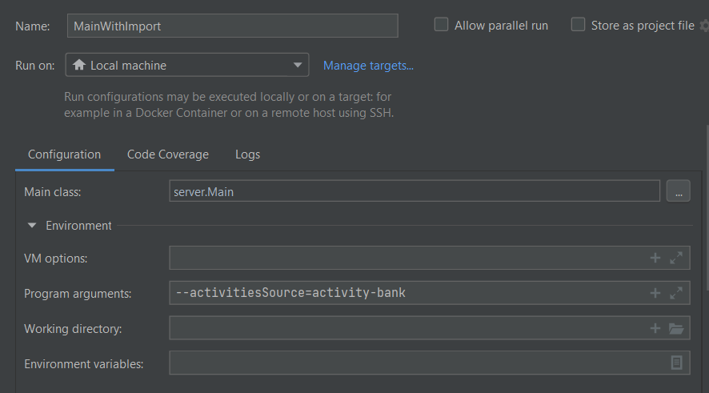

# Starting template

This README will need to contain a description of your project, how to run it, how to set up the development environment, and who worked on it.
This information can be added throughout the course, except for the names of the group members.
Add your own name (do not add the names for others!) to the section below.

## Description of project

## Group members

| Profile Picture | Name                | Email                               |
|---|---------------------|-------------------------------------|
|| Mert Bora İnevi     | M.B.Inevi@student.tudelft.nl        |
|  | Nguyen Duy Anh Quan | NguyenDuyAnhQuan@student.tudelft.nl |
| | Stefan Creasta      | Creasta@student.tudelft.nl          |
| | Alex Pacurar        | A.V.Pacurar-1@student.tudelft.nl    |
| | Anton Kalpakchiev   | A.D.Kalpakchiev@student.tudelft.nl  |
| | Jort Boon           | J.J.Boon@student.tudelft.nl         |

<!-- Instructions (remove once assignment has been completed -->
<!-- - Add (only!) your own name to the table above (use Markdown formatting) -->
<!-- - Mention your *student* email address -->
<!-- - Preferably add a recognizable photo, otherwise add your GitLab photo -->
<!-- - (please make sure the photos have the same size) --> 

## How to run it

The server has to be started before any clients join to it.

### Adding the Activity Bank into the Project Directory

Go to the [activity-bank repository releases page](https://gitlab.ewi.tudelft.nl/cse1105/2021-2022/activity-bank/-/releases) and download the "ZIP Archive with activities and images".

Extract its contents under a folder named activity-bank in\
`[project-root]\server\resources\images\`.

In the end the path\
`[project-root]\server\resources\images\activity-bank\activities.json`\
should exist.

> Note: You can use another folder name than `activity-bank`. This way, you can have multiple activity bank versions that you can import. For other names, you should use the different name for the following references to the `activity-bank` folder.

### Starting the Server

#### Start The Server without Importing The Activities Automatically

##### From the command line
```
cd [project root]
.\gradlew build #if you haven't built yet
java -jar .\server\build\libs\server-0.0.1-SNAPSHOT.jar
# or
java -jar .\server\build\libs\server-0.0.1-SNAPSHOT.jar --server.port=8080
```

##### Within IntelliJ IDEA
Once the project is imported into IntelliJ IDEA, the server can be started from the automatically generated Spring run configuration.

Before any activities are imported and the question database is populated, though, initiating new games won't work properly. You should either import activities from the Admin Panel available in the client or follow up with the next section.

#### Start The Server Importing The Activities Automatically
The server can also import an activity bank at startup if it is configured so.

##### From the command line
```
cd [project root]
.\gradlew build #if you haven't built yet
java -jar .\server\build\libs\server-0.0.1-SNAPSHOT.jar --activitiesSource=activity-bank
# or
java -jar .\server\build\libs\server-0.0.1-SNAPSHOT.jar --server.port=8080 --activitiesSource=activity-bank
```

##### Within IntelliJ IDEA
Assuming that the activity bank to be imported resides under the server directory so the path\
`[project-root]\server\resources\images\activity-bank\activities.json`\
exists, one needs to add `--activitiesSource=activity-bank` as a command line argument to the Spring run configuration or to a copy of it, as seen below.



### Starting the Client

The client needs to be run from IntelliJ IDEA (preferably at least version 2021.2.3)

You will need a copy of the OpenJFX *SDK* for your operating system. Download one from https://gluonhq.com/products/javafx/ -- make sure it is an SDK -- and extract the archive contents under a folder that you can easily find (preferably not in this project's folder).

Add JavaFX as a module for the project under `File>Project Structure...>Project Settings>Modules`. Select the module `quizzzz.client` and on the right panel click `"+">JARs or Directories...` and select the lib path of your JavaFX copy.

Create an Application run configuration with
- JDK version 16 or newer,
- -cp quizzzz.client.main
- main method class client.Main
- and working directory the full path to the project root.
- Modify `Options>Add VM options` and add the following to the box that appears.

Make sure that the correct modules are added to the JVM when the client is run. You can see the necessary VM options below. (Replace the module path with the lib path of your own copy of OpenJFX SDK)
```
--module-path C:\Users\user\Documents\javafx-sdk-17.0.2\lib 
--add-modules javafx.controls,javafx.fxml
```

Then start the client normally.

> Note: If an Application run configuration for the client produces errors related to graphics, you can try using a Gradle run configuration instead.
> It is not much different how VM arguments are added into such a configuration.
>
> Gradle project setting should be the full path to the `[project root]\client` like `~\Documents\oopp-project\client`. You also need to add the same VM options as you would in an Application configuration.

## How to contribute to it
In addition to setting up IntelliJ according to the instructions in the run section, you may also want to set up SceneBuilder for ease in editing the FXML files.

Download SceneBuilder from https://gluonhq.com/products/scene-builder/ and install.

After installing, find the location of its main executable. For example on Windows, you can search for "Scene Builder" in the start menu,
right click and choose "open file location" and keep doing this to shortcuts until you arrive the actual EXE file.

Copy the executable file's path, go back to IntelliJ, go to `File>Settings...>Language and Frameworks>JavaFX`, and paste the path into Path to SceneBuilder.

## Copyright / License (opt.)
